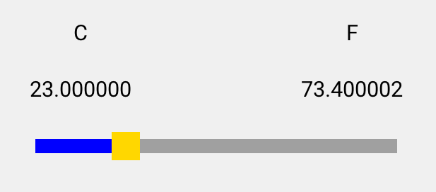

## 第 10 章 数据绑定

通过规则在视图和模型之间建立联系，当用户在视图上修改数据时，视图上的数据自动同步到模型中，当模型中的数据有变化时，自动更新到视图上去，这就是数据绑定。

### 10.1 建立视图与视图模型的联系

在进行数据绑定之前，先要建立视图与视图模型的联系。在 AWTK 中，我们用 XML 文件来描述用户界面，这个 XML 文件就是视图。在上一章中，我们实现了一个温度控制器的视图模型 temperature，现在我们来写一个视图，然后将两者关联起来。在这个视图上有：

* 一个 label 控件用来显示当前的温度。
* 一个 slider 控件用来调节当前的温度。

视图 XML 文件的内容如下（具体细节请参考 AWTK 界面描述文件和布局参数）：

```
<window >
  <label x="center" y="middle" w="50%" h="40" text="0.000000"/>
  <slider x="center" y="middle:40" w="80%" h="20" value="0"/>
</window>
```

> 等 AWStudio 发布后，可以直接通过拖拽生成界面描述文件。

程序运行起来后，界面大概是这样的：


为了将视图与视图模型关联起来，我们为控件引入一个属性"v-model"来指定视图模型的名称，该属性可以应用到任何一个控件上。通常我们在窗口上指定，这样，整个窗口就与该视图模型关联起来了。

比如，下面的例子我们将视图与名为"temperature"的视图模型关联起来：

```
<window v-model="temperature">
...
</window>
```

视图模型的名称是怎么来的呢？在上一章中，我们注册视图模型时，有这样一段代码：

```
view_model_factory_register("temperature", temperature_view_model_create);
```

这段代码的意义就在于：需要名为"temperature"的视图模型时，调用函数 temperature\_view\_model\_create 去创建。

### 10.2 数据绑定的基本用法

数据绑定规则也是一个控件属性：

属性的名称由两部分组成，两者之间用英文冒号分隔。

* v-data 表示该属性是一个数据绑定规则。
* 第二部分是控件属性的名称，表示对该控件的哪个属性进行绑定。

属性的值放在'{'和'}'之间，里面是视图模型中属性的名称。

如：

```
v-data:text="{value}" 表示将控件的"text"属性与视图模型的"value"属性关联起来。
```

```
v-data:value="{value}" 表示将控件的"value"属性与视图模型的"value"属性关联起来。
```

温度控制器的完整示例：

```
<window v-model="temperature">
  <label x="center" y="middle" w="50%" h="40" v-data:text="{value}"/>
  <slider x="center" y="middle:40" w="80%" h="20" v-data:value="{value}"/>
</window>
```

这样，label 的文本和 slider 的值就与视图模型中的温度关联起来了。当用户拖动 slider 时，会自动修改模型中的温度，同时模型中的温度由会自动更新到 label 控件上。

在数据绑定规则中，还可以指定一些高级参数，这些参数之间用英文逗号分隔，后面我们将详细介绍这些参数的作用。

Windows 的命令行下，读者可以运行 demo1 来查看实际的效果。

```
bin\demo1.exe
```

### 10.3 何时将数据更新到模型

运行上面的例子，我们可以看到，拖动滑块时，label 上的文本并不会实时更新，而是松开滑块时，label 上的文本才更新。在有的情况下，我们需要实时更新，此时可以指定 Trigger 参数。Trigger 参数的取值如下：

* Changed 表示在控件触发 EVT\_VALUE\_CHANGED 事件时，将视图上的数据更新到模型，这是缺省的触发方式。对于 slider 控件来说，用户松开滑块时，触发 EVT\_VALUE\_CHANGED 事件。

* Changing 表示在控件触发 EVT\_VALUE\_CHANGING 事件时，将视图上的数据更新到模型。对于 slider 控件来说，用户拖动滑块的过程中，就实时触发 EVT\_VALUE\_CHANGING 事件。

* Explicit 显式的触发。我们经常看到设置界面上有"确定"和"应用"的按钮，点击这些按钮时，才把视图上的数据同步到模型，在这种情况下就可以使用显式触发。

如果需要实时同步到模型，我们可以这样指定：

```
v-data:value="{value, Trigger=Changing}"
```

如果需要显式同步到模型，我们可以这样指定：

```
v-data:value="{value, Trigger=Explicit}"
```

对于上面的例子，如果我们需要实时将数据同步到模型，可以这样写：

```
<window v-model="temperature">
  <label x="center" y="middle" w="50%" h="40" v-data:text="{value}"/>
  <slider x="center" y="middle:40" w="80%" h="20" v-data:value="{value, Trigger=Changing}"/>
</window>
```

Windows 的命令行下，读者可以运行 demo2 来查看实际的效果。

```
bin\demo2.exe
```

### 10.4 视图和模型之间的同步模式

在一些特殊情况下，我们并不需要双向数据绑定，比如一个只读的视图，并不需要把视图中的数据同步到模型里。总之，不同应用场景有不同的需要，所以我们提供了一个 Mode 的参数，它的取值如下：

* Once 一次绑定。数据绑定只是在视图初始化时绑一次，即把模型中的数据显示到界面上，然后就断开两者之间的联系。

* TwoWay 双向数据绑定。即用户通过视图修改数据时，视图上的数据自动同步到模型。当模型的数据有变化时，自动更新到视图上。

* OneWay 单向数据绑定。当模型的数据有变化时，自动更新到视图上。但是用户通过视图修改数据时，视图上的数据不会自动同步到模型。这相当于视图时只读的，不能修改模型。

* OneWayToModel 单向数据绑定到模型。即用户通过视图修改数据时，视图上的数据自动同步到模型。但是模型的数据有变化时，不会自动更新到视图上。

比如，如果只需要在初始化时绑定一次，我们可以这样指定：

```
v-data:value="{value, Mode=Once}"
```

> 一般来说，使用缺省的方式就可以了，无需要另外指定。
> 

### 10.5 数据格式转换

View 上显示的数据是给人看的，Model 里的数据则是为了给计算机存储的，这两者的格式有时是一致的，有时是不同的。如果两者的格式不同，那就需要对数据进行转换，此时我们用数据转换器来实现自动数据转换。

数据转换器需要实现两个函数：

 * to\_model 函数负责将数据转换成适合模型存储的格式。其原型如下：
  
```
typedef ret_t (*value_converter_to_model_t)(value_converter_t* converter, const value_t* from,value_t* to);
```

 * to\_view 函数负责将数据转换成适合视图显示的格式。其原型如下：
```
typedef ret_t (*value_converter_to_view_t)(value_converter_t* converter, const value_t* from, value_t* to);
```

我们再看看温度控制器的例子，温度有摄氏度和华氏度两种单位。虽然作为习惯使用摄氏度的人，没法理解别人为什么要使用华氏度，但是不得说这是一个展示数据转换器的好例子。假设我们做了一个温度控制器，数据库里存储的是摄氏度，该系统要卖到全世界，在有的国家或地区，界面上要显示华氏度的，或者干脆简单点，同时显示摄氏度和华氏度。现在来看看如何实现温度单位的转换。

在 C 语言中，要实现一个接口有些繁琐，所以我们提供了一个 value\_converter\_delegate\_create 函数，它把以上两个转换函数包装成 value\_converter 对象。

```
value_converter_t* value_converter_delegate_create(value_convert_t to_model, value_convert_t to_view);
```

现在我们来写一个温度的数据转换器，其实现是这样的：

```
/*将温度从摄氏度转换成华氏度*/
static ret_t to_temp_f(const value_t* from, value_t* to) {
  value_set_double(to, value_int(from) * 1.8 + 32);

  return RET_OK;
}

/*将温度从华氏度转换成摄氏度*/
static ret_t to_temp_c(const value_t* from, value_t* to) {
  value_set_double(to, (value_int(from) - 32) / 1.8);

  return RET_OK;
}

/*创建 converter 对象*/
static void* create_temp_f_converter(void) {
  return value_converter_delegate_create(to_temp_c, to_temp_f);
}

/*将 converter 创建函数注册到工厂*/
ret_t temperature_converter_init(void) {
  value_converter_register("fahrenheit", create_temp_f_converter);

  return RET_OK;
}

```

框架需要做数据转换的时候，从工厂中创建 converter 的实例，然后调用它的函数进行数据转换。

在数据绑定规则中，把 converter 参数指定为上面注册的名称"fahrenheit"，那在进行数据交换时，框架就会调用上面两个函数进行数据转换了。如：

```
v-data:text="{value, converter=fahrenheit}"
```

现在我们来看看完整的例子，为了方便演示，我们把前面的视图稍微调整一下，在界面上同时显示摄氏度和华氏度。界面的样子大概是这样的：



它的界面描述文件是这样写的：

```
<window  v-model="temperature">
  <label text="C" x="0" y="middle:-40" w="40%" h="40"/>
  <label text="F" x="right" y="middle:-40" w="40%" h="40"/>
  <label x="0" y="middle" w="40%" h="40" v-data:text="{value}"/>
  <label x="right" y="middle" w="40%" h="40" v-data:text="{value, converter=fahrenheit}"/>
  <slider x="center" y="middle:40" w="80%" h="20" v-data:value="{value}"/>
</window>
```

Windows 的命令行下，读者可以运行 demo3 来查看实际的效果。

```
bin\demo3.exe
```

### 10.6 数据有效性验证

用户在界面上输入的数据可能是非法的，编辑器可以做一些基本的判断，比如输入字符串的长度、数值的最大值和最小值等等。但是有些情况是编辑器无法处理的。比如：

* 数据的有效性依赖于当前系统的状态或其它编辑器的内容。
* 根据错误的类型给用户提供有效的提示信息。
* 更精确的错误检查。

此时我们用数据验证器来实现数据的有效性检查，以及自动更正数据的功能。

数据验证器器需要实现两个函数：

* is_valid 用于判断数据是否有效。如果无效需要提供进一步的提示信息。

```
typedef bool_t (*value_validator_is_valid_t)(value_validator_t* validator, const value_t* value, str_t* msg)
```

* fix 用于对无效数据进行修正。

```
typedef ret_t (*value_validator_fix_t)(value_validator_t* validator, value_t* value)
```

我们再看看温度控制器的例子，假设我们做的热水器温度控制器，用户可以设置水温，设置的温度太高或者太低，我们给出提示信息。

在 C 语言中，要实现一个接口有些繁琐，所以我们提供了一个 value\_validator\_delegate\_create 函数，它把以上两个函数包装成 value\_validator 对象。

```
value_validator_t* value_validator_delegate_create(value_is_valid_t is_valid, value_fix_t fix);
```

现在我们来写一个水温的数据验证器，其实现是这样的：

```
/*检查温度是否正常，并设置提示信息*/
static bool_t is_valid_water_temp(const value_t* value, str_t* msg) {
  int32_t temp = value_int(value);

  if (temp <= 20) {
    str_set(msg, "too low");
    return FALSE;
  } else if (temp >= 60) {
    str_set(msg, "too high");
    return FALSE;
  } else {
    str_set(msg, "normal");
    return TRUE;
  }
}

/*这里不做自动修正*/
static ret_t fix_water_temp(value_t* value) {
  return RET_OK;
}

/*创建 validator 对象*/
static void* create_water_temp_validator(void) {
  return value_validator_delegate_create(is_valid_water_temp, fix_water_temp);
}

/*注册 validator 对象*/
ret_t temperature_validator_init(void) {
  value_validator_register("water_temp", create_water_temp_validator);

  return RET_OK;
}
```

框架需要做数据有效性验证的时候，从工厂中创建 validator 的实例，然后调用它的函数进行数据验证。

在数据绑定规则中，把 validator 参数指定为上面注册的名称"water_temp"，在进行数据交换时，框架就会调用上面 validator 进行数据验证和修正了。如：

```
v-data:value="{value, validator=water_temp}"
```

"error.of."前缀后跟属性名，表示该属性的错误信息，通常把一个label控件的文本属性绑定到它就行了。如：

```
v-data:text="{error.of.value}"
```

现在我们来看看完整的例子，为了方便演示，我们把前面的视图稍微调整一下，在界面上显示一个提示信息。界面的样子大概是这样的：


它的界面描述文件是这样写的：

```
<window v-model="temperature">
  <label x="0" y="middle" w="40%" h="40" v-data:text="{value}"/>
  <label x="right" y="middle" w="40%" h="40" v-data:text="{error.of.value}"/>
  <slider x="center" y="middle:40" w="80%" h="20" v-data:value="{value, validator=water_temp}"/>
</window>
```

Windows 的命令行下，读者可以运行 demo5 来查看实际的效果。

```
bin\demo5.exe
```

细心的读者会发现，在整个过程中，我们换了好几个视图，但是并没有修改视图模型。这证实了我们之前所说的：

* 视图是容易变化的。
* MVVM模式能分离用户界面和业务逻辑，让两者相对独立的变化。

