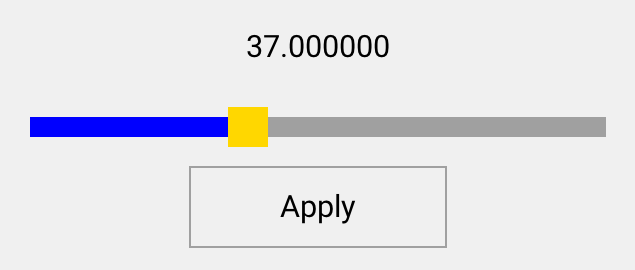

## 第 11 章 命令绑定

在传统的开发方式当中，在用户点击视图中控件的时候，控件会触发一些事件，在这些事件处理函数中，去完成某些任务。在 MVVM 模式当中，则是通过命令绑定规则，建立控件事件与模型函数之间的关系，用户触发某个事件之后，模型的函数自动执行。这种绑定关系更容易理解，让视图与模型之间的耦合也更加松散。

### 11.1 命令绑定的基本用法

命令绑定规则也是一个控件属性：

属性的名称由两部分组成，两者之间用英文冒号分隔。

* v-on 表示该属性是一个命令绑定规则。
* 第二部分是控件事件的名称，表示对该事件触发时，自动执行指定的命令。

命令的名称放在'{'和'}'之间，里面是视图模型中命令的名称。

如：

```
v-on:click="{apply}" 表示将控件的"click"事件与视图模型的"apply"命令关联起来。
```

我们还是以温度控制器为例，假设我们调解温度之后，点击"Apply"按钮才让新的温度生效，如果新的温度与旧的温度相同，则禁用"Apply"按钮，否则启用"Apply"按钮。

新的界面大概是这样的：



它的界面描述文件是这样：

```
<window v-model="temperature">
  <label  x="center" y="middle:-40" w="80%" h="40" v-data:text="{value}"/>
  <slider x="center" y="middle" w="90%" h="20" v-data:value="{value}"/>
  <button text="Apply" x="center" y="middle:40" w="40%" h="40" v-on:click="{apply}"/>
</window>
```

拖动滑块改变温度的值，如果新的值于旧的值不同，"Apply"按钮处于启用状态，当点击"Apply"时，就会调用视图模型中的"apply"，它将旧的值设置为新的值，"Apply"按钮重新处于禁用状态。

在前面介绍用 C 语言实现视图模型时，已经看过视图模型里关于命令处理的代码，这里我们再回顾一下：

```
static bool_t temperature_can_exec_apply(temperature_t* temperature, const char* args) {
  return temperature->old_value != temperature->value;
}

static ret_t temperature_apply(temperature_t* temperature, const char* args) {
  temperature->old_value = temperature->value;
  return RET_OBJECT_CHANGED;
}

static bool_t temperature_view_model_can_exec(object_t* obj, const char* name, const char* args) {
  temperature_view_model_t* vm = (temperature_view_model_t*)(obj);
  temperature_t* temperature = vm->temperature;

  if (tk_str_eq("apply", name)) {
    return temperature_can_exec_apply(temperature, args);
  } else {
    return FALSE;
  }
}

static ret_t temperature_view_model_exec(object_t* obj, const char* name, const char* args) {
  temperature_view_model_t* vm = (temperature_view_model_t*)(obj);
  temperature_t* temperature = vm->temperature;

  if (tk_str_eq("apply", name)) {
    return temperature_apply(temperature, args);
  } else {
    log_debug("not found %s\n", name);
    return RET_NOT_FOUND;
  }
}

```

在命令绑定规则中，还可以指定一些高级参数，这些参数之间用英文逗号分隔，后面我们将详细介绍这些参数的作用。

Windows 的命令行下，读者可以运行 demo6 来查看实际的效果。

```
bin\demo6.exe
```
