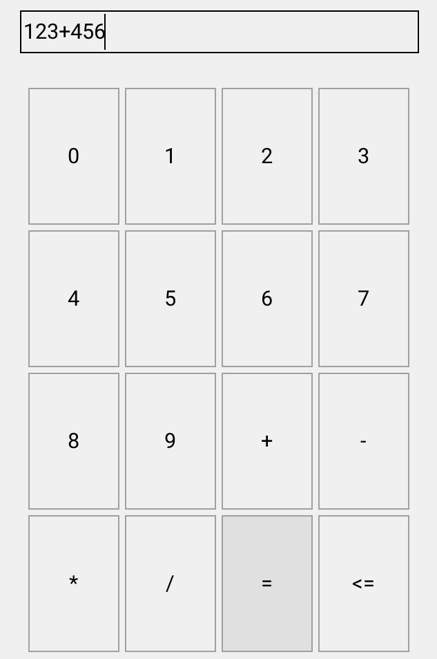

## 第 11 章 命令绑定

在传统的开发方式中，用户操作控件的时候，控件会触发一些事件，在这些事件处理函数中，去完成某些任务。在 MVVM 模式当中，则是通过命令绑定规则，建立控件事件与模型函数之间的联系，用户触发某个事件之后，框架自动执行模型中对应的函数。这种绑定关系更容易理解，让视图与模型之间的耦合也更加松散。

### 11.1 命令绑定的基本用法

命令绑定规则也是一个控件属性：

属性的名称由两部分组成，两者之间用英文冒号分隔。

* v-on 表示该属性是一个命令绑定规则。
* 第二部分是控件事件的名称，表示对该事件触发时，自动执行指定的命令。

命令的名称放在'{'和'}'之间，命令对应视图模型中的函数。

如：

```
v-on:click="{apply}" 表示将控件的"click"事件与视图模型的"apply"命令关联起来。
```

目前支持的事件有（以后更加需要增加）:

* click 点击事件
* pointer_down 指针按下事件
* pointer_up 指针松开事件
* key_down 按键按下事件
* key_up 按键松开事件
* value_changed 值改变事件

我们还是以温度控制器为例，假设我们调节温度之后，点击"Apply"按钮，才让新的温度生效，如果新的温度与旧的温度相同，则禁用"Apply"按钮，否则启用"Apply"按钮。

新的界面大概是这样的：


它的界面描述文件是这样：

```
<window v-model="temperature">
  <label  x="center" y="middle:-40" w="80%" h="40" v-data:text="{value}"/>
  <slider x="center" y="middle" w="90%" h="20" v-data:value="{value}"/>
  <button text="Apply" x="center" y="middle:40" w="40%" h="40" v-on:click="{apply}"/>
</window>
```

拖动滑块改变温度的值，如果新的值与旧的值不同，"Apply"按钮处于启用状态，当点击"Apply"时，就会调用视图模型中的"apply"，它将旧的值设置为新的值，"Apply"按钮重新处于禁用状态。

在前面介绍用 C 语言实现视图模型时，已经看过视图模型里关于命令处理的代码，这里我们再回顾一下：

```
static bool_t temperature_can_exec_apply(temperature_t* temperature, const char* args) {
  return temperature->old_value != temperature->value;
}

static ret_t temperature_apply(temperature_t* temperature, const char* args) {
  temperature->old_value = temperature->value;
  return RET_OBJECT_CHANGED;
}

static bool_t temperature_view_model_can_exec(object_t* obj, const char* name, const char* args) {
  temperature_view_model_t* vm = (temperature_view_model_t*)(obj);
  temperature_t* temperature = vm->temperature;

  if (tk_str_eq("apply", name)) {
    return temperature_can_exec_apply(temperature, args);
  } else {
    return FALSE;
  }
}

static ret_t temperature_view_model_exec(object_t* obj, const char* name, const char* args) {
  temperature_view_model_t* vm = (temperature_view_model_t*)(obj);
  temperature_t* temperature = vm->temperature;

  if (tk_str_eq("apply", name)) {
    return temperature_apply(temperature, args);
  } else {
    log_debug("not found %s\n", name);
    return RET_NOT_FOUND;
  }
}

```

在命令绑定规则中，还可以指定一些高级参数，这些参数之间用英文逗号分隔，后面我们将详细介绍这些参数的作用。

Windows 的命令行下，读者可以运行 demo6 来查看实际的效果。

```
bin\demo6.exe
```

### 11.2 命令的参数

在命令绑定规则中，可以指定一个参数，该参数并不是必须的，但有时命令参数确实能带来不少便利。

在命令绑定规则中，通过 Args 指定命令的参数。如：

```
v-on:click="{add_char, Args=0}"
```

现在我们以一个简单计算器的例子，来看看命令参数是如何使用，以及它带来的便利性。

计算器的界面大概是这样的：



计算器的界面描述文件是这样的：

```
<window v-model="calculator">
  <edit x="c" y="10" w="90%" h="30" focus="true" input_type="custom" text="" tips="expression" v-data:text="{expr}"/>
  <view y="60" x="c" w="90%" h="-60" is_keyboard="true" 
    children_layout="default(r=4,c=4,m=5,s=5)" >
    <button name="key" text="0" v-on:click="{add_char, Args=0}"/>
    <button name="key" text="1" v-on:click="{add_char, Args=1}"/>
    <button name="key" text="2" v-on:click="{add_char, Args=2}"/>
    <button name="key" text="3" v-on:click="{add_char, Args=3}"/>
    <button name="key" text="4" v-on:click="{add_char, Args=4}"/>
    <button name="key" text="5" v-on:click="{add_char, Args=5}"/>
    <button name="key" text="6" v-on:click="{add_char, Args=6}"/>
    <button name="key" text="7" v-on:click="{add_char, Args=7}"/>
    <button name="key" text="8" v-on:click="{add_char, Args=8}"/>
    <button name="key" text="9" v-on:click="{add_char, Args=9}"/>
    <button name="key" text="+" v-on:click="{add_char, Args=+}"/>
    <button name="key" text="-" v-on:click="{add_char, Args=-}"/>
    <button name="key" text="*" v-on:click="{add_char, Args=*}"/>
    <button name="key" text="/" v-on:click="{add_char, Args=/}"/>
    <button name="key" text="=" v-on:click="{eval}"/>
    <button name="backspace" text="<=" v-on:click="{remove_char}"/>
  </view>
</window>

```

这里我们可以看到，数字和运算符全部绑定到"add_char"这个命令上，只是通过参数来区分的，视图模型中，我们只需要实现 add_char 函数即可。如果不使用命令参数，我们就要为每一个按钮写一个命令，那是非常繁琐的。

这个函数的实现也是相当的简单，把参数作为字符串追加到表达式中即可：

```
static ret_t calculator_add_char(calculator_t* calculator, const char* args) {
  str_append(&(calculator->expr), args);
  return RET_OBJECT_CHANGED;
}
```

读者可以从 demos/common/calculator.c 文件中看到完整的代码。这个例子有点特殊，它的全部代码都是从 calculator.json 自动产生出来的。

```
{
  "name":"calculator",
  "desc":"a simple calculator",
  "includes":["tkc/expr_eval.h"],
  "props": [
    {
      "name":"expr",
      "desc":"the expression",
      "type":"char*"
    }
  ],
  "cmds": [
    {
      "name":"add_char",
      "canExec": true,
      "impl":"str_append(&(calculator->expr), args);",
      "desc":"add a char to expression"
    },
    {
      "name":"remove_char",
      "canExec": "return calculator->expr.size > 0;",
      "impl":"str_pop(&(calculator->expr));",
      "desc":"remove last char of expression"
    },
    {
      "name":"eval",
      "impl":"str_from_float(&(calculator->expr), tk_expr_eval(calculator->expr.str));",
      "canExec": "return calculator->expr.size > 0;",
      "desc":"eval the expression"
    }
  ]
}

```

写这个 JSON 文件是在定义模型的接口，这也是一个设计的过程，能帮助开发者思考，同时又能少些大量单调的代码，花些时间去掌握代码产生器是值得的。

Windows 的命令行下，读者可以运行 demo7 来查看实际的效果。

```
bin\demo7.exe
```

### 11.3 更新模型的参数

在前面我们提到，将数据从视图同步到模型有三种触发方式，其中一个称为显式更新，需要在命令执行之前，显式的将视图的数据同步到模型。

这可以通过命令的 UpdateModel 参数来实现。其用法如下：

先将数据更新的触发方式指定为 Explicit：

```
v-data:value="{value, Trigger=Explicit}"
```

然后再指定命令的 UpdateModel 参数：

```
v-on:click="{nothing, UpdateModel=true}"
```

> 这里我们用了 nothing 命令，它是一个特殊命令，除了参数要求的事情之外，它什么也不做。这里它就只是同步视图的数据到模型。

完整示例如下：

```
<window v-model="temperature">
  <label x="center" y="middle" w="50%" h="40" v-data:text="{value}"/>
  <slider x="center" y="middle:40" w="80%" h="20" v-data:value="{value, Trigger=Explicit}"/>
  <button name="apply" text="Apply" x="center" y="bottom:10" w="80%" h="30" 
    v-on:click="{nothing, UpdateModel=true}"/>
</window>

```

Windows 的命令行下，读者可以运行 demo4 来查看实际的效果。

```
bin\demo4.exe
```

### 11.4 关闭当前窗口的参数

有时，在执行完某个命令后，需要关闭当前窗口。但命令是在视图模型中实现的，它不能直接操作界面，也就不能直接关闭窗口，否则就与视图耦合起来了。

在执行完某个命令后，需要关闭当前窗口，可以通过命令的 CloseWindow 参数来实现。其用法如下：

```
v-on:click="{nothing, CloseWindow=true}"
```

如果只是单纯的关闭当前窗口，可以使用 nothing 命令，也可以在执行实际的命令后关闭。

比如，下面这个例子中：

* 点击"OK"按钮，执行 return 命令，然后关闭窗口。
* 点击"Cancel"按钮，执行 nothing 命令，然后关闭窗口。

```
<window children_layout="default(r=3, c=1)" v-model="room_settings">
 <label floating="true" x="center" y="10" w="50%" h="40" v-data:text="{room}"/>

  <view>
    <label x="center" y="30" w="90%" h="40" text="temperature"/>
    <label x="center" y="middle" w="50%" h="40" v-data:text="{temp}"/>
    <slider x="center" y="middle:40" w="80%" h="20" v-data:value="{temp, Trigger=Changing}"/>
  </view>

  <view>
    <label x="center" y="30" w="90%" h="40" text="humidity"/>
    <label x="center" y="middle" w="50%" h="40" v-data:text="{humidity}"/>
    <slider x="center" y="middle:40" w="80%" h="20" v-data:value="{humidity, Trigger=Changing}"/>
  </view>

  <button text="OK" floating="true" x="center:-90" y="bottom:40" w="100" h="40" 
    v-on:click="{return, CloseWindow=true}"/>

  <button text="Cancel" floating="true" x="center:90" y="bottom:40" w="100" h="40" 
    v-on:click="{nothing, CloseWindow=true}"/>
</window>
```

Windows 的命令行下，读者可以运行 demo12 来查看实际的效果。

```
bin\demo12.exe
```

### 11.5 退出应用程序的参数

有时，在执行完某个命令后，需要退出应用程序。但命令是在视图模型中实现的，不能直接退出应用程序，否则该命令就无法进行单元测试。

在执行完某个命令后，需要退出应用程序，可以通过命令的 QuitApp 参数来实现。其用法如下：

```
v-on:click="{nothing, QuitApp=true}"
```

如果只是单纯的退出应用程序，使用 nothing 命令即可。

完整示例如下：

```
<window v-model="temperature">
  <label x="center" y="30" w="90%" h="40" text="temperature"/>
  <label x="center" y="middle" w="50%" h="40" v-data:text="{value}"/>
  <button text="Quit" x="center" y="middle:40" w="40%" h="40" v-on:click="{nothing, QuitApp=true}"/>
</window>
```

Windows 的命令行下，读者可以运行 demo10 来查看实际的效果。

```
bin\demo10.exe
```

### 11.6 事件参数
(TODO)

### 11.7 内置命令

AWTK-MVVM 框架内置了几条常用的命令，可以避免在每个模型里都去实现。即使视图没有绑定视图模型，这些命令也是可以执行的，所以在一些简单的情况下，开发者甚至连视图模型都不用提供。

#### 11.7.1 nothing

它本身什么也不做，行为取决于参数。前面已经出现了好几次，读者应该已经熟悉了，这里不再赘述了。

#### 11.7.2 navigate

打开新窗口是经常要处理的事情，如果不需要在新窗口和当前窗口之间传递数据，那么可以直接使用 navigate 命令，并把 args 指定为新窗口的名称即可。如：

```
  v-on:click="{navigate, args=humidity}"/>
```

我们来看看完整的例子，在这个例子中，并没有用 v-model 指定视图模型，这是可以的：

```
<window>
  <button text="Temperature" x="center" y="middle:-40" w="40%" h="40" 
    v-on:click="{navigate, args=temperature9}"/>
  <button text="Humidity" x="center" y="middle:40" w="40%" h="40" 
    v-on:click="{navigate, args=humidity}"/>
</window>
```

Windows 的命令行下，读者可以运行 demo10 来查看实际的效果。

```
bin\demo10.exe
```

窗口导航是一个有趣的话题，涉及的内容也比较多，下一章我们再详细讨论。
