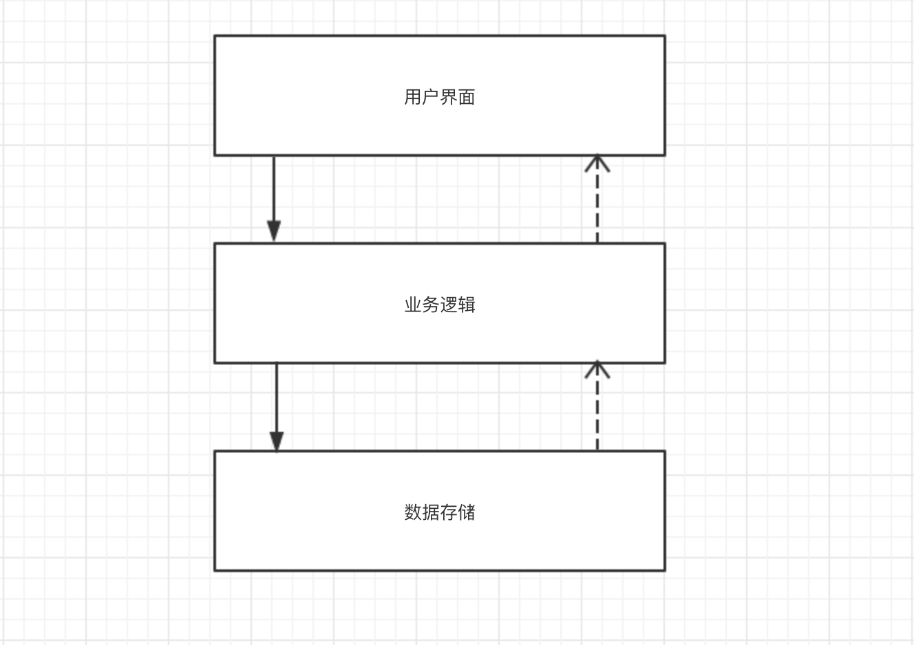

## 第 12 章 窗口导航

用程序通常有多个窗口，窗口之间的切换以及参数的传递，这就是窗口导航。窗口导航是个常用的功能，有没有 MVVM 框架都需要这个功能，为什么我们要把它纳入 MVVM 框架内来讨论呢？

大家知道模型是不能操作界面的，但是很多时候模型必须和用户进行交互。比如：

* 在写文件的过程中磁盘满了，要询问用户是中断操作还是清理垃圾。
* 购买的过程中，发现余额不足，要询问用户是放弃购买还是否充值。
* 在执行某个命令时，需要打开另外一个窗口。

由此可见，模型有时就得操作界面！如果不能解决这个问题，就没有达到彻底隔离用户界面和业务逻辑的目标。这是 MVVM 窗口导航要做的事情，所以放在 MVVM 中来讨论。

在传统分层设计中，将应用程序分成 3 层。分层设计的基本原则是，上层可以直接调用下层的函数，下层则只能通过回调函数或消息或事件通知上层，让上层执行某些动作。



提供回调函数给下层其实就是依赖注入，对于协议栈（如 TCP/IP) 来说，是非常方便的，因为需要提供的回调函数并不多。但是对应用程序来说，虽然不是不可能，但实际操作确实很困难，这样做的话，API 接口会很复杂，调用者理解也很困难。

Bob 大叔在《架构整洁之道》17 章中说：

>只要 GUI 是以插件形式插入业务逻辑的，那么 GUI 这边所发生的变更就不会影响系统的业务逻辑。

AWTK-MVVM 中的窗口导航就是一个插件系统，在模型中通过 MVVM 的导航器打开窗口，并不会导致模型与视图的耦合。

假设我们要打开 settings 窗口：

AWTK 传统的打开方法是：

```
window_open("settings");
```

AWTK-MVVM 的打开方法是：

```
navigator_to("settings");
```

两者从外在看起来，除了函数名不同，好像也没有什么差别啊。但是两者本质上是不同的：

* 前者就是执行打开窗口的动作，如果执行成功就会打开窗口。这是编译的时候就定死了的，相对于硬编码，如果在模型中调用它，那模型就直接和 GUI 耦合到一起了。

* 后者则只是表达一致意图，发出一个请求，至于做什么，谁来做，调用者是完全不用关心的。在正常运行时，我们可以打开一个窗口，也可以执行另外一个应用程序。在测试时，我们可以什么也不做，让自动测试在没有用户的干预下继续往下运行。也就是说，它的行为完全由导航器这个插件系统中当前注册的插件决定。

AWTK-MVVM 中的导航器就是一个全局的依赖注入系统，一个视图的插件系统，让模型可以请求视图，同时又避免和视图的耦合到一起。

12.1 打开窗口的正确方式

12.2 处理请求参数

12.3 返回处理结果

12.4 编写自己的插件

